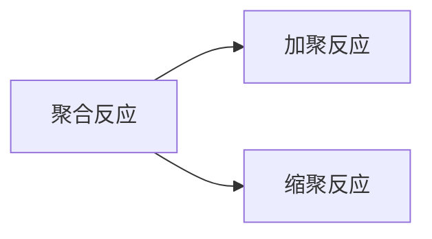

## 生物

### 无子果实的问题

果实无子问题常与生长素一起问，那原理是啥呢？

无子番茄利用的生长素促进果实发育的原理。果实一般分`果皮`和`种子`两部分，我们吃番茄时主要吃的就是它的果皮部分，果皮是由子房壁发育而来的，种子是由胚珠发育而来。种子在发育过程中会产生生长素，生长素能够促进子房壁发育成种皮。在培育无子番茄时，我们不让番茄授粉。这样就无法形成种子，也就产生不了生长素，**但是由于我们在雌蕊柱头上涂抹了一定浓度的生长素或生长素类似物，这样虽然没有发育着的种子产生的生长素，子房壁照样可以发育成果皮，于是形成的就是无子果实。**

单倍体是由配子不经受精作用直接发育成的个体，因此它的体细胞中只有本物种正常体细胞中染色体的一半，与本物种配子中的染色体数目相同。而无子番茄是由子房壁发育而来，子房壁是母本的一部分，子房壁细胞就是母本的体细胞，母本是二倍体，因此它虽然没有经过受精作用，但也不应该属于单倍体，而是二倍体。（但是，事实上，单倍体、双倍体的概念只能在个体水平上使用，这里只是迎合题目需要）

## 化学

### 补充一些常见的反应

```
有过量的氨气时，8NH3+3Cl2⇌N2+6NH4Cl
有少量的氨气时，2NH3+3Cl2⇌N2+6HCl  -->非金属置换反应
```


## 合金

青铜是不是纯净物？

书上说，合金是一种混合物，但是，网上查到的是：合金之间连接是靠着金属与金属之间的共价键，所以从这个角度来说的话，合金又是一种纯净物？？那合金究竟是混合物，还是纯净物？实际上，不同的结构还有不同的答案，以合金的三种分类来说：

1.相互溶解。形成金属固溶体，如铜锌形成的黄铜合金；

2.相互起化学作用。形成金属化合物，如铝钛合金，青铜应该属于这一类（其实我不太确定）；

3.相互混合。形成机械混合物，如焊锡。很明显，①、③属于混合物，②属于纯净物。

所以合金是不是混合物，不能一概而论。至于合金会不会改变金属的化学性质，刚好只有②才有了化学变化。

### 聚合反应



## 物理

### 等效重力场

这个视频可以解决几乎所有重力洛仑磁力复合场问题。

<iframe id="spkj" src="https://player.bilibili.com/player.html?aid=380851023&bvid=BV1Vf4y1F7z9&cid=489600456&page=1&autoplay=0" scrolling="no" border="0" frameborder="no" framespacing="0" allowfullscreen="true" width="100%" height="400"> </iframe>

